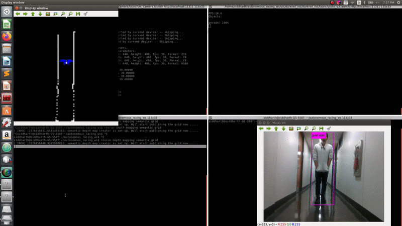
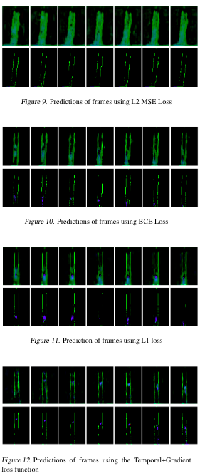

## Semantic Mapping

Only detections with more than 95 percent are mapped on the image. The images are saved in the specified location in the semantic_depth.h file in include/depth_mapping/. 

```
git clone https://github.com/Singh-sid930/ros_yolo_depth
```

The above package is needed to publish the depth information and correlated pixel coordinates of the detected bounding boxes. It is a derived from the original darknet_yolo ros implementation by Legged Robotics Lab ETH zurich. 

To run the semantic mapper run the following commands 

```
roslaunch realsense2_camera rs_camera.launch
```
``` 
roslaunch darknet_ros yolo_v3.launch
```
```
rosrun depth_mapping semantic_grid 
```

People are shown as blue. White pixels are unclassified obstacles or obstacles with confidence less than 95 percent. Vehicles are shown as yellow. Everything else will be red. 



We also perform predictions on the semantic map using an LSTM based neural network which performs the task of reconstrucing the map as predictions 10 seconds in the future. We experiment with different type of losses. the results of the different losses are shown here. 


